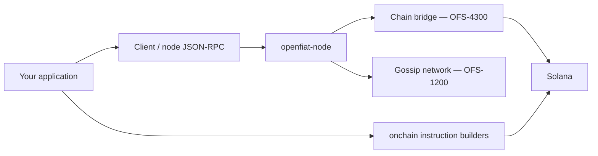

# Architecture — openfiat-sdks

Two independent paths, not one client wrapping the other:

- **`Client`** (Rust: `openfiat_sdk::Client`; TypeScript: `Client` from
  `@openfiat/sdk`) is a typed JSON-RPC 2.0 client (OFS-8200) for a single
  `openfiat-node`. `get*` calls read that node's local, gossip-replicated
  state directly. `send*` calls take a domain event's unsigned shape plus a
  keypair, sign it client-side, and submit it — the node never sees an
  unsigned or client-authenticated request. Typed coverage today: `node`,
  `chain`, `advertisements`, `notifications`, `oracles`, `providers`,
  `reservations` (Rust also has `disputes` and `governance`; TypeScript
  calls those two by JSON-RPC method name directly, see each SDK's own
  README).
- **`onchain`** (`openfiat_sdk::onchain` / `onchain` export) builds Solana
  instructions for the three deployed Anchor programs (`openfiat-escrow`,
  `openfiat-staking`, `openfiat-governance`, OFS-4200) directly against
  Solana — it never talks to an `openfiat-node` at all. A caller signs and
  submits the resulting instruction with the Solana SDK of their chosen
  language (`solana-transaction`/`solana-keypair` in Rust,
  `@solana/web3.js` in TypeScript).
- The **chain bridge** (`chain.getChainStatus`/`getLatestBlockhash`/
  `sendTransaction`) is the one place these two paths meet: it lets a
  caller submit an already-built, already-signed transaction *through* a
  node rather than directly to Solana, and ask that node what it currently
  observes about the chain — useful when a caller only has an
  `openfiat-node` endpoint and no direct Solana RPC access of its own.
  Behavior is identical whether that node itself is `GossipOnly` or
  `RpcConnected`.

Domain types (Rust: reused from `openfiat-core` via a pinned git
dependency; TypeScript: hand-transcribed from the same `events.rs`/
`record.rs` sources, field-for-field, since these describe the exact JSON
`serde` produces) are the same shapes a real node actually sends and
expects — not a separately-maintained approximation.
